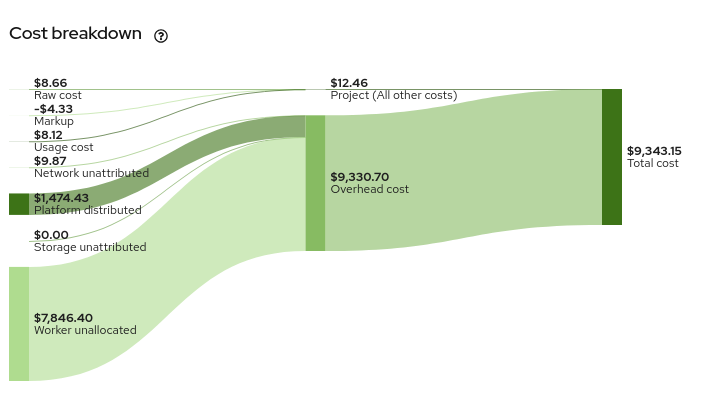
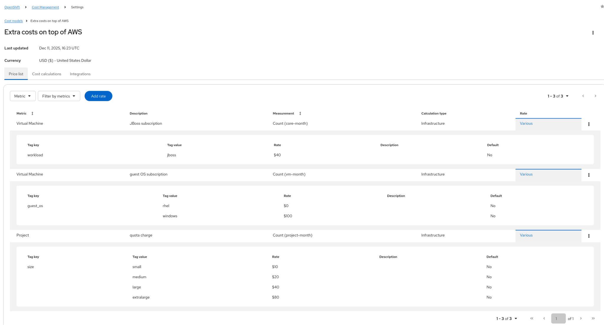
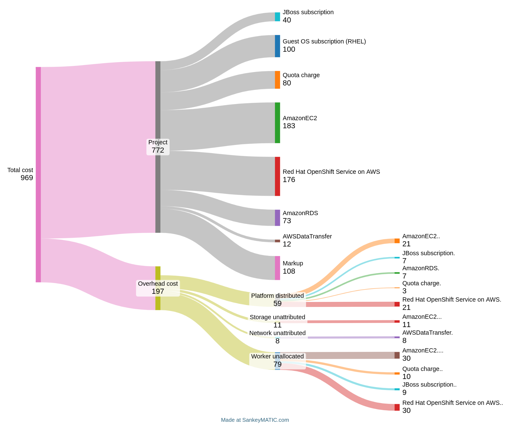

# PRD04 COST-2105 / COST-4415: Cost Breakdown for Custom Costs

## Goal

Provide a detailed cost breakdown in the Sankey diagram using concepts and items the user can directly relate to: individual cloud services (AmazonEC2, AmazonRDS, etc.) and individual price list rate names (JBoss subscription, Guest OS subscription, etc.), rather than opaque aggregate categories (raw cost, usage cost).

## Who Is Asking for It?

Many customers.

Design validated by Pau with a customer on 12/15/2025.

## Who Is It For?

**Primary personas:**

- **FinOps practitioners** performing monthly cost reporting and chargeback allocation who need to understand exactly which cloud services and custom charges contribute to each project's total cost.
- **Platform engineers** managing OpenShift clusters who need visibility into how their cost model rates (custom charges for middleware, OS licenses, quotas, etc.) flow through to project-level and overhead costs.

**Use cases:**

- Monthly chargeback reporting: "Show me exactly what makes up Project X's $772 cost."
- Cost model validation: "Are my JBoss subscription rates being applied correctly?"
- Overhead attribution: "What's driving the $59 of platform distributed cost?"
- Anomaly investigation: "Why did this project's cost spike? Which service or rate changed?"

## What Is It?

### Current State

The Sankey diagram (introduced in COST-5852) shows cost flow from source categories to aggregate totals:



We used to have two pie charts:
- **Cost breakdown:** raw cost, usage cost, overhead, unallocated, markup
- **Overhead breakdown:** storage unattributed, worker unallocated, platform, etc.

That was confusing so with COST-5852 we evolved that into the current Sankey diagram, where we have one graph for everything. The problem is those concepts are not exactly what customers are looking for. They want to know:

1. What's the breakdown of "raw cost" into its cloud services constituents (AWS EC2, AWS RDS, AWS S3, etc.)
2. What's the breakdown of "usage cost" into the line items they added to their price list
3. What's the breakdown of platform distributed using constituents from (1) and (2)
4. What's the breakdown of worker unallocated, storage unattributed, etc. using constituents from (1) and (2)

### Desired State

The Sankey adds a new layer of detail on the left side, breaking down each cost category into its constituent rate names (Phase 1) and cloud services (Phase 2). The flow direction matches the existing chart: parts compose into aggregates left-to-right.

**Phase 1 (rate names):** Usage cost and each overhead type get a breakdown layer:

```
JBoss subscription --------\
Guest OS subscription ------+--> Usage cost -------\
Quota charge --------------/                       |
                                                   |
                              Raw cost ------------+--> Project (workload) ---\
                              Markup --------------/                          |
                                                                             +--> Total cost
JBoss subscription -----\                                                    |
Quota charge -----------+--> Platform distributed --\                        |
Cloud cost ------------/                            |                        |
                                                    +--> Overhead cost ------/
JBoss subscription -----\                           |
Quota charge -----------+--> Worker unallocated ---/
Cloud cost ------------/                           |
                              Storage unattributed-/
                              Network unattributed/
```

**Phase 2 (adds cloud services):** Raw cost also gets a breakdown layer (AmazonEC2, AmazonRDS, etc.), markup gets proportional breakdown by service, and overhead types gain cloud service detail alongside rate names.

```
JBoss subscription --------\
Guest OS subscription ------+--> Usage cost -------\
Quota charge --------------/                       |
                                                   |
AmazonEC2 -----------------\                       |
Red Hat OpenShift Service --+--> Raw cost ---------+--> Project (workload) ---\
AmazonRDS -----------------/                       |                          |
AWSDataTransfer -----------/                       |                          |
                                                   |                          |
AmazonEC2 -----------------\                       |                          |
Red Hat OpenShift Service --+--> Markup -----------/                          |
AmazonRDS -----------------/                                                  |
AWSDataTransfer -----------/                                                  |
                                                                             +--> Total cost
AmazonEC2 --------\                                                          |
JBoss subscription +--> Platform distributed --\                             |
AmazonRDS --------/                            |                             |
Quota charge ----/                             |                             |
Red Hat OpenShift Service -/                   +--> Overhead cost -----------/
                                               |
AmazonEC2 --------\                            |
Quota charge ------+--> Worker unallocated ---/
JBoss subscription /                          |
Red Hat OpenShift Service -/                  |
                           Storage unattrib.--/
                           Network unattrib.-/
```

### Jira Breakdown

| Jira | Scope | Phase |
|------|-------|-------|
| [COST-2105](https://issues.redhat.com/browse/COST-2105) | Cost breakdown per price list rate constituents (usage cost, tag rates, monthly rates) | Phase 1 |
| [COST-4415](https://issues.redhat.com/browse/COST-4415) | Cost breakdown per cloud service constituents (raw cost by product_code/service_name) | Phase 2 |

---

## How Will It Work?

### Example Scenario

Let's say I have a ROSA OpenShift cluster and I have defined a few extra charges for software subscriptions: JBoss middleware, guest OS subscription (Windows and RHEL). In addition to that, some of my workloads are using RDS databases and I've used the special tags to associate the cost of some RDS instances with some namespaces.

For a cost model like this:

**Price list name:** "Extra costs on top of AWS"

| Rate Name | Metric | Measurement | Tag-based | Values |
|-----------|--------|-------------|-----------|--------|
| JBoss subscription | Virtual Machine | Count (core-month) | workload=jboss | $40 |
| Guest OS subscription | Virtual Machine | Count (vm-month) | guest_os=rhel: $0, guest_os=windows: $100 | Various |
| Quota charge | Project | Count (project-month) | size=small: $10, medium: $20, large: $40, extralarge: $80 | Various |

**Rate creation example:**



### Expected Sankey Output

I would expect to see new rate name nodes on the left side of the Sankey, flowing into the existing cost category nodes. The flow direction is left-to-right (parts compose into aggregates), consistent with the existing chart:

- JBoss subscription
- Guest OS subscription
- Quota charge
- AmazonEC2 (Phase 2)
- Red Hat OpenShift Service on AWS (Phase 2)
- AmazonRDS (Phase 2)
- AWSDataTransfer (Phase 2)
- (more if there's more that would apply)



**SankeyMATIC input for Phase 1 (rate names only):**

The existing nodes (Raw cost, Markup, Usage cost, overhead types, Project/workload, Overhead, Total cost) remain unchanged. Rate names are added as a new leftmost layer flowing into Usage cost and each overhead type:

```
// Rate names -> Usage cost (new layer)
JBoss subscription[40] Usage cost
Guest OS subscription[100] Usage cost
Quota charge[80] Usage cost

// Existing nodes (unchanged)
Raw cost[183] Project
Markup[108] Project
Usage cost[220] Project

// Rate names -> overhead types (new layer)
JBoss subscription[7] Platform distributed
Quota charge[3] Platform distributed
Cloud cost[49] Platform distributed
JBoss subscription[9] Worker unallocated
Quota charge[10] Worker unallocated
Cloud cost[60] Worker unallocated
Cloud cost[11] Storage unattributed
Cloud cost[8] Network unattributed

// Existing overhead -> Overhead cost (unchanged)
Platform distributed[59] Overhead cost
Worker unallocated[79] Overhead cost
Storage unattributed[11] Overhead cost
Network unattributed[8] Overhead cost

// Existing aggregate -> total (unchanged)
Project[511] Total cost
Overhead cost[157] Total cost
```

**SankeyMATIC input for Phase 2 (adds cloud services):**

Phase 2 additionally breaks down Raw cost and Markup into cloud service constituents:

```
// Rate names -> Usage cost
JBoss subscription[40] Usage cost
Guest OS subscription[100] Usage cost
Quota charge[80] Usage cost

// Cloud services -> Raw cost (Phase 2)
AmazonEC2[183] Raw cost
Red Hat OpenShift Service on AWS[176] Raw cost
AmazonRDS[73] Raw cost
AWSDataTransfer[12] Raw cost

// Cloud services -> Markup (Phase 2)
AmazonEC2[44.50] Markup
Red Hat OpenShift Service on AWS[42.80] Markup
AmazonRDS[17.74] Markup
AWSDataTransfer[2.96] Markup

// Existing cost categories -> workload
Raw cost[444] Project
Markup[108] Project
Usage cost[220] Project

// Rate names + cloud services -> overhead types
AmazonEC2[21] Platform distributed
Red Hat OpenShift Service on AWS[21] Platform distributed
JBoss subscription[7] Platform distributed
AmazonRDS[7] Platform distributed
Quota charge[3] Platform distributed

AmazonEC2[30] Worker unallocated
Red Hat OpenShift Service on AWS[30] Worker unallocated
Quota charge[10] Worker unallocated
JBoss subscription[9] Worker unallocated

AmazonEC2[11] Storage unattributed
AWSDataTransfer[8] Network unattributed

// Existing overhead -> Overhead cost
Platform distributed[59] Overhead cost
Worker unallocated[79] Overhead cost
Storage unattributed[11] Overhead cost
Network unattributed[8] Overhead cost

// Existing aggregate -> total
Project[772] Total cost
Overhead cost[157] Total cost
```

That was an example of per-project breakdown into custom rates (Phase 1) and cloud service (Phase 2) constituents. We need the same for cluster, node, tag and OpenShift Virtualization VMs.

### Breakdown Perspectives

This breakdown must be available for all OCP report perspectives:

| Perspective | Views |
|-------------|-------|
| Project (namespace) | OCP costs_by_project, OCP-on-cloud costs_by_project |
| Cluster | OCP costs, OCP-on-cloud costs |
| Node | OCP costs grouped by node |
| Tag | OCP costs grouped by tag |
| Virtual Machines | OCP VM view (OpenShift Virtualization) |

**Not required for:** Cost Explorer, pure cloud provider views (AWS/Azure/GCP without OCP).

### Environment Support

This table shows the target state across both phases. Phase 1 delivers usage cost and overhead breakdown only. Raw cost and markup breakdown are Phase 2.

| Environment | Raw cost breakdown (Phase 2) | Usage cost breakdown (Phase 1) | Overhead breakdown (Phase 1) | Markup breakdown (Phase 2) |
|-------------|-------------------|---------------------|-------------------|-----------------|
| OCP on-prem (PostgreSQL-only) | N/A (no cloud) | By rate name | By rate name proportions | N/A (no cloud raw cost, so no markup) |
| OCP on-cloud (Trino + PostgreSQL) | By product_code/service_name | By rate name | By rate name + service proportions | By service proportions |
| OCP Virtualization on-prem | N/A (no cloud) | By rate name | By rate name proportions | N/A (no cloud raw cost, so no markup) |
| OCP Virtualization on-cloud | By product_code/service_name | By rate name | By rate name + service proportions | By service proportions |

---

## New "Name" Field on Rates

### Specification

We will add a new mandatory `name` field to the rates in the price list. It should be a free text with a maximum of 50 characters so that it won't clutter the Sankey charts. The current `description` will stay optional. The `name` field will be utilized inside of the UI for Sankey charts.

| Property | Value |
|----------|-------|
| Field name | `name` |
| Type | String |
| Max length | 50 characters |
| Required | Yes (mandatory) |
| Unique scope | Per cost model (no two rates in the same cost model can have the same name) |
| Purpose | Short label for Sankey chart nodes |

The existing `description` field remains optional (max 500 chars).

### Migration Strategy for Existing Rates

Since the `name` field is new and mandatory, we must migrate the current rates to the new rates. The default strategy will be:

1. **Has description (len <= 50):** Automatically create names from the descriptions.
2. **Has description (len > 50):** Shorten to 47 chars + "...".
3. **Duplicate names after shortening:** When that results in duplicate names because there's two or more rates with the same shortened description, we will remove the last 3 characters and use incremental numbers: `000`, `001`, `002`, etc.
4. **No description:** When a rate currently has no description, we will create names based on the metric and some number to disambiguate, e.g. `cluster_count_cluster_hour_001`, `node_count_core_month_007`, etc. Ugly but functional.

### Cross-Cost-Model Display

When multiple cost models are applied to the same cluster and both contain a rate with the same name (e.g., both have "JBoss subscription"), the Sankey should display them as a single aggregated node since the user conceptually sees them as the same charge. If disambiguation is needed in the future, we can prefix with the cost model name.

---

## API Contract

### Backward-Compatible Response Extension

Extend the existing report API response by adding an optional `breakdown` array to each cost category. Existing clients that do not read `breakdown` are unaffected.

**Current response (unchanged):**

```json
{
  "cost": {
    "raw": {"value": 183.00, "units": "USD"},
    "usage": {"value": 220.00, "units": "USD"},
    "markup": {"value": 108.00, "units": "USD"},
    "platform_distributed": {"value": 59.00, "units": "USD"},
    "worker_unallocated_distributed": {"value": 79.00, "units": "USD"},
    "storage_unattributed_distributed": {"value": 11.00, "units": "USD"},
    "network_unattributed_distributed": {"value": 8.00, "units": "USD"},
    "total": {"value": 969.00, "units": "USD"}
  }
}
```

**Phase 1 extended response (breakdown on `usage` and overhead types only):**

In Phase 1, `raw` and `markup` remain unchanged (no breakdown). Only `usage` and overhead types (`platform_distributed`, `worker_unallocated_distributed`, etc.) gain `breakdown` arrays:

```json
{
  "cost": {
    "raw": {"value": 183.00, "units": "USD"},
    "usage": {
      "value": 220.00,
      "units": "USD",
      "breakdown": [
        {"name": "Guest OS subscription", "source": "rate", "value": 100.00, "units": "USD"},
        {"name": "Quota charge", "source": "rate", "value": 80.00, "units": "USD"},
        {"name": "JBoss subscription", "source": "rate", "value": 40.00, "units": "USD"}
      ]
    },
    "markup": {"value": 108.00, "units": "USD"},
    "platform_distributed": {
      "value": 59.00,
      "units": "USD",
      "breakdown": [
        {"name": "Cloud cost", "source": "cloud", "value": 49.00, "units": "USD"},
        {"name": "JBoss subscription", "source": "rate", "value": 7.00, "units": "USD"},
        {"name": "Quota charge", "source": "rate", "value": 3.00, "units": "USD"}
      ]
    },
    "worker_unallocated_distributed": {
      "value": 79.00,
      "units": "USD",
      "breakdown": [
        {"name": "Cloud cost", "source": "cloud", "value": 60.00, "units": "USD"},
        {"name": "Quota charge", "source": "rate", "value": 10.00, "units": "USD"},
        {"name": "JBoss subscription", "source": "rate", "value": 9.00, "units": "USD"}
      ]
    },
    "storage_unattributed_distributed": {
      "value": 11.00,
      "units": "USD",
      "breakdown": [
        {"name": "Cloud cost", "source": "cloud", "value": 11.00, "units": "USD"}
      ]
    },
    "network_unattributed_distributed": {
      "value": 8.00,
      "units": "USD",
      "breakdown": [
        {"name": "Cloud cost", "source": "cloud", "value": 8.00, "units": "USD"}
      ]
    },
    "total": {"value": 969.00, "units": "USD"}
  }
}
```

**Phase 2 extended response (adds breakdown on `raw` and `markup`):**

Phase 2 additionally breaks down `raw` into cloud service constituents and `markup` into proportional service breakdown. Overhead breakdown gains per-service entries replacing the Phase 1 `"Cloud cost"` placeholder:

```json
{
  "cost": {
    "raw": {
      "value": 444.00,
      "units": "USD",
      "breakdown": [
        {"name": "AmazonEC2", "source": "service", "value": 183.00, "units": "USD"},
        {"name": "Red Hat OpenShift Service on AWS", "source": "service", "value": 176.00, "units": "USD"},
        {"name": "AmazonRDS", "source": "service", "value": 73.00, "units": "USD"},
        {"name": "AWSDataTransfer", "source": "service", "value": 12.00, "units": "USD"}
      ]
    },
    "markup": {
      "value": 108.00,
      "units": "USD",
      "breakdown": [
        {"name": "AmazonEC2", "source": "service", "value": 44.50, "units": "USD"},
        {"name": "Red Hat OpenShift Service on AWS", "source": "service", "value": 42.80, "units": "USD"},
        {"name": "AmazonRDS", "source": "service", "value": 17.74, "units": "USD"},
        {"name": "AWSDataTransfer", "source": "service", "value": 2.96, "units": "USD"}
      ]
    },
    "platform_distributed": {
      "value": 59.00,
      "units": "USD",
      "breakdown": [
        {"name": "AmazonEC2", "source": "service", "value": 21.00, "units": "USD"},
        {"name": "Red Hat OpenShift Service on AWS", "source": "service", "value": 21.00, "units": "USD"},
        {"name": "JBoss subscription", "source": "rate", "value": 7.00, "units": "USD"},
        {"name": "AmazonRDS", "source": "service", "value": 7.00, "units": "USD"},
        {"name": "Quota charge", "source": "rate", "value": 3.00, "units": "USD"}
      ]
    }
  }
}
```

**Breakdown entry fields:**

| Field | Type | Description |
|-------|------|-------------|
| `name` | string | Display label: rate name (from price list), cloud service name (product_code/service_name), `"Cloud cost"` (Phase 1 placeholder), or `"Other"` (top-N aggregation) |
| `source` | string | `"rate"` for cost model rate, `"service"` for cloud service (Phase 2), `"cloud"` for aggregated cloud cost (Phase 1), `"other"` for top-N remainder |
| `value` | decimal | Cost amount |
| `units` | string | Currency code |

### Cost Model API Extension

The `POST/PUT /api/cost-management/v1/cost-models/` `rates` array gains a new `name` field per rate:

```json
{
  "rates": [
    {
      "name": "JBoss subscription",
      "metric": {"name": "virtual_machine"},
      "cost_type": "Infrastructure",
      "description": "JBoss middleware license charge per core-month",
      "tag_rates": {
        "tag_key": "workload",
        "tag_values": [
          {"tag_value": "jboss", "value": 40, "unit": "USD", "default": false}
        ]
      }
    }
  ]
}
```

---

## Phasing Plan

### Phase 1: Custom Rate Breakdown (COST-2105)

**Scope:** Break down "usage cost" into individual price list rate names. Break down overhead costs by pre-computed per-rate-name attribution from the distribution SQL. Raw cost and markup remain as single aggregates (deferred to Phase 2). Works on all environments (on-prem and cloud).

**Backend changes:**

1. **Cost model schema**: Add mandatory `name` field (max 50 chars) to `RateSerializer`. Add uniqueness validation per cost model. Data migration for existing rates.
2. **Data model**: Add `cost_model_rate_name` column (TextField, nullable) to `OCPUsageLineItemDailySummary`.
3. **Cost model DB accessor** (`cost_model_db_accessor.py`): Extend `price_list`, `infrastructure_rates`, `supplementary_rates`, and `metric_to_tag_params_map` to also carry the rate `name` alongside the rate value. Currently these structures only extract numeric values; the `description` field is never read by the accessor.
4. **Cost model cost updater** (`ocp_cost_model_cost_updater.py`): Thread rate names through all `_update_*` methods to the DB accessor calls.
5. **Cost application SQL**: Update all cost model application SQL to accept and set `cost_model_rate_name`:
   - **Tag rates** (`infrastructure_tag_rates.sql`, `supplementary_tag_rates.sql`, defaults): Already executed per `(metric, tag_key, tag_value)` -- add `{{rate_name}}` parameter. Straightforward.
   - **Monthly rates** (`monthly_cost_cluster_and_node.sql`, `monthly_cost_persistentvolumeclaim.sql`, `monthly_cost_virtual_machine.sql`): Already executed per cost type -- add `{{rate_name}}` parameter. Straightforward.
   - **VM rates** (`hourly_cost_virtual_machine.sql`, `hourly_vm_core.sql`, `monthly_vm_core.sql`): Already per-rate execution -- add `{{rate_name}}` parameter.
   - **Tiered usage rates** (`usage_costs.sql`): Currently applies ALL tiered rates in a single INSERT (cpu + memory + volume together). Must be refactored to execute per-rate so each rate gets its own `cost_model_rate_name`. See [Tiered Rate Attribution](#tiered-rate-attribution) below.
6. **Distribution SQL**: Modified to distribute per `cost_model_rate_name` (split CTE pattern). Distributed rows carry both `cost_model_rate_type` and `cost_model_rate_name`, so overhead breakdown is pre-computed at distribution time, not approximated at query time. See [Overhead Distribution Breakdown](#overhead-distribution-breakdown) below.
7. **New breakdown summary tables** (zero regression risk): Create **parallel** breakdown-specific summary tables (e.g., `reporting_ocp_cost_breakdown_by_project_p`) that GROUP BY `cost_model_rate_name`. Existing summary tables remain untouched. The API queries existing tables for aggregate response and new tables for the `breakdown` array.
8. **Provider map**: Add new annotations for the breakdown aggregation. Extend `PACK_DEFINITIONS` with breakdown keys.
9. **Query handler**: Extend `_format_query_response()` to include the `breakdown` field in each cost category. Read pre-computed overhead breakdown from the breakdown summary tables (no query-time proportional computation).
10. **Migration**: Django migration 0344+ adding the `cost_model_rate_name` column. Separate migration for new breakdown summary tables. Data migration for existing cost model rate names.

**Frontend changes:**

1. **Cost model editor**: Add `name` field to rate creation/editing form (required, max 50 chars).
2. **Sankey diagram**: Consume the new `breakdown` array to render per-rate nodes.

**Estimated complexity:** High. Touches cost model schema, all cost application SQL (PostgreSQL and Trino paths), distribution SQL, summary table generation, provider maps, query handlers, serializers.

### Phase 2: Cloud Service Breakdown (COST-4415)

**Scope:** Break down "raw cost" into cloud service constituents (AmazonEC2, AmazonRDS, etc.). Break down markup proportionally by service. Extend overhead breakdown with service-level proportions.

**Backend changes:**

1. **Data model**: The `product_code` (AWS/GCP) and `service_name` (Azure) fields already exist in OCP-on-cloud line item and summary tables (`OCPAWSCostSummaryByServiceP`, `OCPAzureCostSummaryByServiceP`, etc.). The key challenge is making this available in the OCP report API response alongside the rate breakdown from Phase 1.
2. **OCP line item table**: Add `product_code` / `service_name` to `OCPUsageLineItemDailySummary` (or use the OCP-on-cloud line items as the source). This may already be populated for OCP-on-cloud rows.
3. **UI summary tables**: Extend or create summary tables that include service-level aggregation alongside rate-name aggregation.
4. **Provider map / query handler**: Extend the breakdown response to include service-source entries alongside rate-source entries.
5. **Markup breakdown**: Markup is `infrastructure_raw_cost * markup_percentage`. Since raw cost is already per-service in OCP-on-cloud tables, markup breakdown by service is a straightforward derivation (multiply each service's raw cost by the markup rate). Can be computed at query time or pre-computed.
6. **Overhead service-level breakdown**: Extend the distribution proportionality calculation to include both rate names (Phase 1) and cloud services.

**Frontend changes:**

1. **Sankey diagram**: Render service-source nodes (green/service color) alongside rate-source nodes (blue/rate color) using the `source` field to distinguish.

**Estimated complexity:** Medium (much of the infrastructure from Phase 1 is reused).

---

## Implementation Notes

### Data Model Assessment

**Current pattern:** `OCPUsageLineItemDailySummary` already creates multiple rows per `cost_model_rate_type` (Infrastructure, Supplementary, platform_distributed, worker_distributed, etc.). The UI summary SQL then groups by `cost_model_rate_type`. This multiplicative-row pattern is the established approach.

**Recommended approach:** Follow the same pattern. Add `cost_model_rate_name` as a new column on the line item table and create additional rows as needed. This is consistent with how `cost_model_rate_type` works and ensures:

- Standard Django ORM aggregation (SUM, GROUP BY) works naturally.
- Both PostgreSQL and Trino paths can use the same column.
- Existing indexes and partition strategies remain effective.
- No JSON parsing needed at query time.

**Summary table strategy (zero regression risk):** Create **new, parallel** breakdown summary tables rather than modifying the existing ones. Existing summary tables (`reporting_ocp_cost_summary_p`, `reporting_ocp_cost_summary_by_project_p`, etc.) remain untouched -- their GROUP BY, indexes, and row counts are unchanged. The API queries existing tables for aggregate cost fields and queries the new breakdown tables for the `breakdown` array. This avoids regressions in the overview dashboard, CSV exports, forecasting, and any other consumer of the current summary tables.

**Performance impact:** The new breakdown summary tables will have more rows (one per rate name per day per namespace/cluster/node). For a typical cost model with 5-10 rates, this is a 5-10x increase compared to the existing tables, but the new tables are only queried when the `breakdown` field is needed. Given the existing monthly partitioning and source-scoped queries, this is acceptable.

**Alternative considered (JSONField breakdown):** Storing per-rate breakdown as a JSONField avoids row multiplication but makes SQL aggregation across rate names impossible without `jsonb_each()` or equivalent. This breaks the natural Django ORM pattern, complicates Trino queries, and prevents GROUP BY on rate names. Not recommended.

### Rate Name Flow: Python/SQL Boundary

**Current state (from code triage):**

`CostModelDBAccessor` extracts only numeric rate values from `CostModel.rates` JSON. The structures it exposes are:

- `infrastructure_rates` / `supplementary_rates`: `{metric_name: value}` -- no name, no description
- `metric_to_tag_params_map`: `{metric: [{rate_type, tag_key, default_rate, value_rates}]}` -- no name
- `price_list`: `{metric_name: rate_object}` -- has the full rate dict, but callers only read `value`

The rate `description` field exists in the JSON but is **never read** by the accessor. The proposed `name` field will need the same treatment as `description` -- stored in the JSON, but now actively extracted and threaded through.

**Required refactoring:**

1. **`CostModelDBAccessor`**: Extend `price_list` and `metric_to_tag_params_map` to also carry the rate `name`:
   - `infrastructure_rates`: change from `{metric_name: value}` to `{metric_name: {"value": X, "name": "rate name"}}`
   - `metric_to_tag_params_map`: add `"name"` to each tag rate params dict
   - Keep backward compatibility: callers that only need the value can access `rates[metric]["value"]`

2. **`OCPCostModelCostUpdater`**: Pass rate name when calling:
   - `populate_usage_costs()` -- needs rate name per metric
   - `populate_monthly_cost_sql()` -- needs rate name per cost type
   - `populate_tag_usage_costs()` -- needs rate name per tag rate (already iterated per tag key/value, so the rate name comes from the parent rate object)

3. **`OCPReportDBAccessor` methods**: Accept `rate_name` parameter, include it in `sql_params`:
   - `populate_usage_costs()`: add `rate_name` to params dict
   - `populate_monthly_cost_sql()`: add `rate_name` to params dict
   - `populate_tag_usage_costs()`: add `rate_name` to params dict (per iteration)

4. **SQL templates**: Add `cost_model_rate_name` to INSERT column list, use `{{rate_name}}` parameter.

### Overhead Distribution Breakdown

**Current mechanism (from code triage):** Distribution SQL (e.g., `distribute_platform_cost.sql`) distributes overhead costs proportionally by CPU/memory usage across user projects. Each project gets a `distributed_cost` value and `cost_model_rate_type = 'platform_distributed'`. The SQL uses **aggregated cost totals** to compute the platform cost pool and uses **CPU/memory usage shares** to distribute. It does **not** track or store the source cost composition (which services or rates contributed to the overhead).

**All five distribution types follow the same pattern:**

| Distribution | Source namespace | `cost_model_rate_type` | Distribution basis |
|---|---|---|---|
| Platform | Namespaces in `Platform` cost category | `platform_distributed` | CPU/memory usage share |
| Worker | `Worker unallocated` | `worker_distributed` | CPU/memory usage share |
| Storage | `Storage unattributed` | `unattributed_storage` | CPU/memory usage share |
| Network | `Network unattributed` | `unattributed_network` | CPU/memory usage share |
| GPU | `GPU unallocated` | `gpu_distributed` | Pod uptime share (from `openshift_gpu_usage_line_items_daily`) |

**Decision: Distribute per `cost_model_rate_name` in SQL (split CTE pattern).** The distribution SQL is modified to iterate over each unique `cost_model_rate_name` in the source namespace, distributing each rate's cost share separately. Distributed rows now carry both `cost_model_rate_type` (e.g., `'platform_distributed'`) AND `cost_model_rate_name` (e.g., `'JBoss subscription'`). This produces accurate per-rate-name overhead attribution pre-computed at distribution time.

**Why not query-time proportional approximation?** Platform namespaces may have a completely different cost composition than user namespaces. A query-time proportional model would incorrectly attribute overhead using the receiving project's cost mix rather than the source platform's actual cost composition. Pre-computing at distribution time uses the correct source data.

The query handler simply reads the pre-computed breakdown from the breakdown summary tables — no proportional computation needed at query time.

### Markup Breakdown

Markup is `infrastructure_raw_cost * markup_percentage` (applied via Django ORM, not SQL file). Since:

- **Phase 1 (rate names only):** Markup applies to infrastructure raw cost (cloud cost), not to usage cost (rate cost). For pure on-prem OCP, raw cost is $0 so markup is $0. For on-cloud, markup is on cloud services. In Phase 1, cloud service breakdown is not yet available, so markup breakdown is deferred to Phase 2. Phase 1 shows markup as a single aggregate (current behavior).
- **Phase 2 (cloud services):** OCP-on-cloud tables already have per-service `infrastructure_raw_cost`. Markup per service = `per_service_raw_cost * markup_percentage`. Straightforward derivation at query time.

### Tiered Rate Attribution

**Current state (from code triage):** `usage_costs.sql` applies ALL tiered rates in a single INSERT. It accepts 11 rate parameters (cpu_core_usage_per_hour, cpu_core_request_per_hour, memory_gb_usage_per_hour, etc.) and computes `cost_model_cpu_cost`, `cost_model_memory_cost`, `cost_model_volume_cost` in one row. A row can have costs from multiple rates (e.g., CPU rate + memory rate).

**Challenge:** Each rate in the price list maps to one metric (e.g., `cpu_core_usage_per_hour`). If a user has:
- Rate "CPU charge" -> `cpu_core_usage_per_hour = $0.05`
- Rate "Memory charge" -> `memory_gb_usage_per_hour = $0.03`

These are two separate rates with two separate names, but the current SQL puts them in one row.

**Approach:** Refactor `populate_usage_costs()` to execute per-rate instead of all-at-once:
- Group tiered rates by their resource type (cpu, memory, volume)
- Execute the SQL once per resource type group, setting `cost_model_rate_name` for that group
- Each execution only sets the relevant cost column (e.g., `cost_model_cpu_cost` for CPU rates, others as 0)
- This produces separate rows per rate name, following the existing multiplicative-row pattern

For the common case where a user has exactly one rate per resource type (one CPU rate, one memory rate), this produces the same number of rows as today plus the rate name attribution. For users with no tiered rates (tag-only or monthly-only), no change.

### SQL Files Requiring Changes

**Cost model application SQL (add `cost_model_rate_name` column and `{{rate_name}}` parameter):**

| SQL File | Execution granularity | Change complexity |
|----------|----------------------|-------------------|
| `sql/openshift/cost_model/usage_costs.sql` | Refactor from all-at-once to per-rate | High |
| `sql/openshift/cost_model/infrastructure_tag_rates.sql` | Already per (metric, tag_key, tag_value) | Low |
| `sql/openshift/cost_model/supplementary_tag_rates.sql` | Already per (metric, tag_key, tag_value) | Low |
| `sql/openshift/cost_model/default_infrastructure_tag_rates.sql` | Already per (metric, tag_key) | Low |
| `sql/openshift/cost_model/default_supplementary_tag_rates.sql` | Already per (metric, tag_key) | Low |
| `sql/openshift/cost_model/monthly_cost_cluster_and_node.sql` | Already per cost type | Low |
| `sql/openshift/cost_model/monthly_cost_persistentvolumeclaim.sql` | Already per cost type | Low |
| `sql/openshift/cost_model/monthly_cost_virtual_machine.sql` | Already per cost type | Low |
| `trino_sql/openshift/cost_model/hourly_cost_virtual_machine.sql` | Already per rate | Low |
| `trino_sql/openshift/cost_model/hourly_vm_core.sql` | Already per rate | Low |
| `trino_sql/openshift/cost_model/monthly_vm_core.sql` | Already per rate | Low |

**Distribution SQL: No changes.**

**New breakdown summary SQL (new files):**

| New SQL File | Based on | Additional GROUP BY |
|---|---|---|
| `sql/openshift/ui_summary/reporting_ocp_cost_breakdown_p.sql` | `reporting_ocp_cost_summary_p.sql` | `cost_model_rate_name` |
| `sql/openshift/ui_summary/reporting_ocp_cost_breakdown_by_project_p.sql` | `reporting_ocp_cost_summary_by_project_p.sql` | `cost_model_rate_name` |
| `sql/openshift/ui_summary/reporting_ocp_cost_breakdown_by_node_p.sql` | `reporting_ocp_cost_summary_by_node_p.sql` | `cost_model_rate_name` |
| `sql/openshift/ui_summary/reporting_ocp_vm_breakdown_p.sql` | `reporting_ocp_vm_summary_p.sql` | `cost_model_rate_name` |

### Django Migrations Required

| Migration | Type | Details |
|-----------|------|---------|
| `reporting/migrations/0344_*.py` | AddField | Add `cost_model_rate_name` (TextField, null=True) to `OCPUsageLineItemDailySummary` |
| `reporting/migrations/0345_*.py` | CreateModel | New breakdown summary tables (`OCPCostBreakdownP`, `OCPCostBreakdownByProjectP`, `OCPCostBreakdownByNodeP`, `OCPVMBreakdownP`) with `set_pg_extended_mode` pattern |
| `cost_models/migrations/NNNN_*.py` | Data migration (RunPython) | Populate `name` field on existing rates in all `CostModel.rates` JSON |
| Serializer change (no migration) | Schema | Add and validate `name` field in `RateSerializer` |

---

## Acceptance Criteria

### Phase 1 (COST-2105)

**Cost model:**

- [ ] Each rate in a price list has a mandatory `name` field (max 50 chars, unique per cost model).
- [ ] Existing rates are migrated with auto-generated names per the migration strategy.
- [ ] Cost model API accepts and validates the `name` field on create/update.
- [ ] Cost model API returns the `name` field in rate responses.

**Cost breakdown API:**

- [ ] OCP report endpoints (`/reports/openshift/costs/`, `/reports/openshift/costs/?group_by[project]=*`, etc.) return a `breakdown` array on `usage` and each overhead type (`platform_distributed`, `worker_unallocated_distributed`, `storage_unattributed_distributed`, `network_unattributed_distributed`, `gpu_unallocated_distributed`).
- [ ] `raw` and `markup` remain unchanged in Phase 1 (no `breakdown` array — deferred to Phase 2).
- [ ] Each breakdown entry has `name` (rate name), `source: "rate"`, `value`, and `units`. Overhead entries for cloud-sourced cost use `source: "cloud"` with `name: "Cloud cost"` as a Phase 1 placeholder.
- [ ] Breakdown is available for: project, cluster, node, tag, and virtual machine perspectives.
- [ ] Existing response fields are unchanged (backward compatible).
- [ ] Works on both PostgreSQL-only (on-prem) and Trino+PostgreSQL (cloud) paths.
- [ ] Overhead breakdown reflects pre-computed per-rate-name attribution from the distribution SQL.

**Frontend:**

- [ ] Rate creation/editing form includes the `name` field (required, max 50 chars).
- [ ] Sankey diagram renders individual rate names as new nodes on the left side, flowing into the existing cost category nodes (usage, overhead types). The flow direction is parts-to-total (left-to-right), consistent with the current chart.
- [ ] Overhead types (platform distributed, worker unallocated, etc.) receive flow from constituent rate name nodes on the left side.
- [ ] The `raw`, `markup`, and `credit` nodes remain unchanged (no breakdown sub-layer in Phase 1).

### Phase 2 (COST-4415)

**Cost breakdown API:**

- [ ] OCP-on-cloud report endpoints return `breakdown` on the `raw` cost category with cloud service names.
- [ ] Each breakdown entry has `name` (product_code or service_name), `source: "service"`, `value`, and `units`.
- [ ] Markup cost category includes a `breakdown` proportional to the raw cost service composition.
- [ ] Overhead breakdown now includes both rate names (`source: "rate"`) and cloud services (`source: "service"`).
- [ ] Works for OCP+AWS, OCP+Azure, OCP+GCP, and the OCP-All cross-cloud view.
- [ ] Works for OpenShift Virtualization on-cloud.
- [ ] Backward compatible.

**Frontend:**

- [ ] Sankey diagram renders cloud service nodes alongside rate name nodes.
- [ ] Visual distinction between rate-source and service-source nodes (color coding or labeling).
- [ ] Overhead nodes flow into both rate and service constituent nodes.

---

## Open Questions

1. **Top-N limiting:** For clusters with many cloud services (>15), should the Sankey show a top-N with an "Other" aggregate, or show all? Large Sankey diagrams can become unreadable. **Recommendation:** Show top 10 by value, aggregate remainder as "Other services" / "Other rates".

2. **Tiered rate multi-rate edge case:** If a cost model has two separate tiered rates for the same metric (e.g., two different CPU rates), should they produce two separate rows with different names, or be aggregated? **Recommendation:** Aggregate per metric as one entry for Phase 1; revisit if users request finer granularity.

3. **Supplementary vs Infrastructure cost type in breakdown:** Should the breakdown distinguish between Infrastructure and Supplementary rate types, or merge them under the rate name? The current Sankey already separates these at the top level. **Recommendation:** Merge under rate name in the breakdown (the rate name is the user-facing concept; Infrastructure/Supplementary is an implementation detail).

4. **Export/CSV:** Should the breakdown data be included in CSV exports? **Recommendation:** Yes, as additional columns, in a follow-up.
