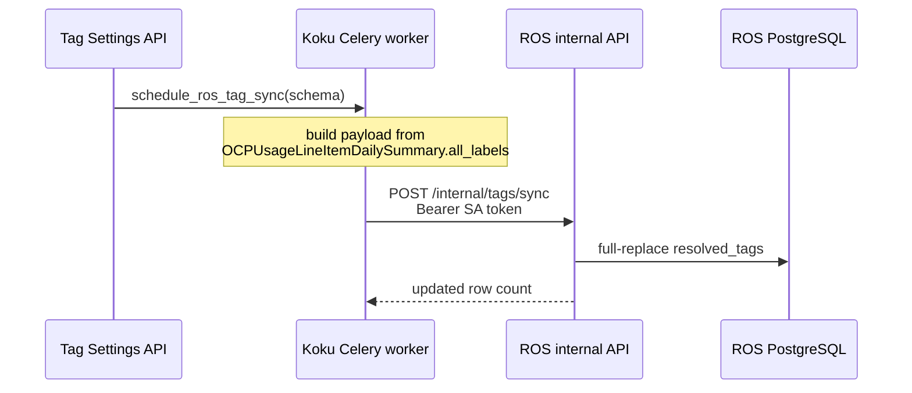

# Resource Optimization Service (ROS) Integration

This document describes how the ROS-OCP backend integrates with Koku for
resource optimization recommendations.

---

## Overview

ROS-OCP is a sibling service that provides CPU, memory, and GPU rightsizing
recommendations for containerized workloads on OpenShift. It consumes cost
data from Koku and the same CSV reports uploaded by the
[koku-metrics-operator](https://github.com/RedHatInsights/koku-metrics-operator).

**Repository:** [`ros-ocp-backend`](../../../../ros-ocp-backend/) (Go service)

---

## Architecture

```
┌─────────────────────┐
│ koku-metrics-operator│
│ (OpenShift cluster)  │
└──────────┬──────────┘
           │ tar.gz upload (manifest.json + CSV reports)
           ▼
┌─────────────────────┐
│ Ingress Service      │  ← insights-ingress-go (validates, stores in S3)
└──────────┬──────────┘
           │ Kafka: platform.upload.announce
           ▼
┌─────────────────────┐     ┌─────────────────────────┐
│ Koku Listener        │────▶│ Koku Worker (Celery)     │
│ (cost processing)    │     │ Process CSV → summaries  │
└──────────────────────┘     └─────────────────────────┘
           │ Kafka: platform.upload.announce
           ▼
┌─────────────────────┐     ┌─────────────────────────┐
│ ROS Processor        │────▶│ ROS PostgreSQL           │
│ (Go: ingestion +     │     │ daily_container_digests  │
│  recommendation      │     │ gpu_container_digests    │
│  engine)             │     │ recommendation_sets      │
└──────────────────────┘     └─────────────────────────┘
           │
           │ GET /effective_rates/ (cost data)
           ▼
┌─────────────────────┐
│ Koku Masu API        │  ← Returns configured cost rates per cluster/org
└──────────────────────┘
           │
           ▼
┌─────────────────────┐
│ ROS API (Go)         │  ← GET /recommendations/openshift/...
│ Enriches with GPU,   │
│ savings, boxplots    │
└──────────────────────┘
           │
           ▼
┌─────────────────────┐
│ koku-ui (React)      │  ← Optimizations tab
└──────────────────────┘
```

---

## Koku ↔ ROS Integration Points

### 1. Shared Ingress Pipeline

Both Koku and ROS consume the same upload from the operator. The tarball contains:

- **`manifest.json`** — metadata with `files` (Koku: pod/node usage) and
  `resource_optimization_files` (ROS: container-level metrics)
- **Pod/node CSVs** — processed by Koku for cost reporting
- **Container CSVs** — processed by ROS for recommendations

The Kafka topic `platform.upload.announce` notifies both services.

### 2. Effective Rates Endpoint (Koku → ROS)

**Endpoint:** `GET /api/cost-management/v1/effective_rates/`

**Source:** [`masu/api/effective_rates.py`](../../koku/masu/api/effective_rates.py)

ROS calls this endpoint to fetch cost rates for savings estimation. Parameters:

| Parameter | Description |
|-----------|-------------|
| `cluster_id` | OCP cluster UUID |
| `org_id` | Organization ID |

Returns aggregated per-namespace cost data including:

- CPU/memory usage hours and costs
- Infrastructure costs (raw + markup)
- Distributed overhead (platform, worker, storage, network, GPU)
- Configured cost model rates (`cpu_core_usage_per_hour`, `memory_gb_usage_per_hour`, `gpu_cost_per_month`, etc.)
- `currency` — ISO 4217 code from the cost model's `tiered_rates[0].unit` (default `"USD"`)

The SQL query aggregates from `reporting_ocpusagelineitem_daily_summary`
with `data_source IN ('Pod', 'GPU')` to include GPU distribution costs.

### 3. Cost Model Rates Used by ROS

ROS uses these cost model metrics from the `effective_rates` response:

| Rate | ROS Usage |
|------|-----------|
| `cpu_core_usage_per_hour` | CPU savings estimation |
| `memory_gb_usage_per_hour` | Memory savings estimation |
| `storage_gb_request_per_month` | Quota/PVC storage savings (primary) |
| `storage_gb_usage_per_month` | Quota/PVC storage savings (fallback when request rate is zero) |
| `gpu_cost_per_month` | GPU savings (idle = full rate, MIG = fractional, time-slicing = shared) |
| Infrastructure costs | Per-namespace overhead apportionment |

Koku returns every metric defined in the cluster's cost model in
`configured_rates`. ROS resolves storage savings via
[`StorageRequestPerMonth()`](../../../../ros-ocp-backend/internal/engine/cost_rates.go):
prefer `storage_gb_request_per_month` (infrastructure + supplementary sum), fall back
to `storage_gb_usage_per_month` when the request rate is zero or missing.

### 4. Recommendation API Proxy (Koku → ROS)

Quota recommendation endpoints are implemented in ros-ocp-backend and **proxied**
through the Koku API gateway — Koku does not implement the handlers itself.

| Deployment | Proxy mechanism |
|------------|-----------------|
| SaaS (Clowder) | Nginx in koku-api routes `/api/cost-management/v1/recommendations/` to `ros-ocp-api` ([`deploy/clowdapp.yaml`](../../deploy/clowdapp.yaml)) |
| On-prem (Helm) | Envoy gateway routes the same prefix to `ros-api-backend` ([cost-onprem-chart gateway ConfigMap](../../../../cost-onprem-chart/cost-onprem/templates/gateway/configmap-envoy.yaml)) |

Quota and cluster-quota routes (when the corresponding ROS plugin is enabled):

| Method | Path | Purpose |
|--------|------|---------|
| `GET` | `/api/cost-management/v1/recommendations/openshift/quota/` | Namespace ResourceQuota recommendations |
| `GET` | `/api/cost-management/v1/recommendations/openshift/quota/detail` | Single quota recommendation detail |
| `GET/PUT/DELETE` | `/api/cost-management/v1/recommendations/openshift/settings/quota` | Per-org quota engine settings |
| `GET` | `/api/cost-management/v1/recommendations/openshift/cluster-quota/` | ClusterResourceQuota recommendations |
| `GET` | `/api/cost-management/v1/recommendations/openshift/cluster-quota/detail` | Single cluster-quota detail |
| `GET/PUT/DELETE` | `/api/cost-management/v1/recommendations/openshift/settings/cluster-quota` | Per-org cluster-quota settings |

Implementation: ros-ocp-backend [`internal/api/handlers_quota_recs.go`](../../../../ros-ocp-backend/internal/api/handlers_quota_recs.go),
[`handlers_cluster_quota_recs.go`](../../../../ros-ocp-backend/internal/api/handlers_cluster_quota_recs.go).

### 5. Savings Recalculation (Koku → ROS)

When a cost model is updated, Koku notifies ros-ocp-backend to recalculate
estimated savings across recommendation types.

**Task:** [`masu/processor/ros_savings_recalc.py`](../../koku/masu/processor/ros_savings_recalc.py)

**Endpoint (ROS internal):** `POST /api/cost-management/v1/internal/recalculate-savings`

**Default recommendation types** (`DEFAULT_RECOMMENDATION_TYPES`):

```python
("container", "node", "pvc", "quota", "cluster-quota")
```

Including `quota` and `cluster-quota` ensures namespace and cluster ResourceQuota
savings are refreshed when cost model rates change, alongside container, node, and
PVC recommendations.

### 6. Business Hours Reship (ROS → Koku)

When an administrator changes a business-hours schedule in ROS, the service must
re-ingest historical ROS CSVs with dual `schedule_type` digests (`all_hours` +
`business_hours`). ROS triggers Koku Masu to **re-publish** objects already stored
in the ROS S3 bucket — no new upload from the cluster.

**Endpoint:** `POST /api/cost-management/v1/reship_ros/`

**Source:** [`masu/api/reship_ros.py`](../../koku/masu/api/reship_ros.py)

**ROS client:** [`internal/reship/client.go`](../../../../ros-ocp-backend/internal/reship/client.go)

#### Query parameters

| Parameter | Required | Description |
|-----------|----------|-------------|
| `schema` | Yes | Tenant schema (e.g. `org1234567`) |
| `provider_uuid` | Yes | Koku provider UUID for the cluster |
| `start_date` | Yes | Inclusive start date (`YYYY-MM-DD`) |
| `end_date` | Yes | Inclusive end date (`YYYY-MM-DD`) |

ROS supplies a lookback window (container plugin max window, default 90 days).
Masu lists S3 keys under `{schema}/source={provider_uuid}/date={day}/` for each day
in range, presigns URLs (48h TTL), and publishes one Kafka message per object to the
ROS topic (same shape as [`ROSReportShipper.build_ros_msg`](../../koku/masu/external/ros_report_shipper.py)).

#### Response (`200 OK`)

```json
{
  "request_id": "abc123...",
  "files_processed": 42,
  "files_total": 42
}
```

| Status | Cause |
|--------|-------|
| `400` | Missing/invalid parameters or `end_date` before `start_date` |
| `503` | ROS S3 credentials not configured (`S3_ROS_*`) |
| `500` | S3 list or Kafka publish failure |

**Authentication:** Internal Masu API — no `x-rh-identity` (service-to-service).

**Tests:** [`masu/test/api/test_reship_ros.py`](../../koku/masu/test/api/test_reship_ros.py)

ROS-side orchestration (poller, retries, metrics): ros-ocp-backend
[`docs/architecture/cost-integration.md`](../../../../ros-ocp-backend/docs/architecture/cost-integration.md#business-hours-reship-reship_ros).

### 7. Shared Source/Provider Registration

ROS uses the same `cluster_uuid` registered as a Koku Source/Provider.
The `clusters` table in the ROS database references the same cluster UUID.

---

## ROS Recommendation Engines

### Native Go Engine (default)

The native engine processes CSV data into daily digests, applies exponential
decay weighting, and computes percentile-based recommendations with
configurable terms and safety margins.

Key subsystems:

- **Ingestion pipeline** — CSV parsing → percentile computation → daily digest upsert
- **GPU pipeline** — Separate `gpu_container_digests` table for DCGM profiling metrics
- **Recommendation engine** — Multi-term (short/medium/long) with decay weighting
- **GPU recommender** — Classification, MIG profiling, time-slicing analysis
- **Savings estimator** — Integrates cost data from Koku `effective_rates`

### Kruize (legacy)

When `ROS_ENABLED_PLUGINS=kruize`, the ROS processor delegates to Kruize
Autotune via HTTP for recommendation computation. This path is maintained
for backward compatibility. (Note: the former `ROS_USE_NATIVE_ENGINE` flag
has been removed; the native engine is now unconditionally active unless
Kruize is explicitly selected via `ROS_ENABLED_PLUGINS`.)

---

## Tag Sync (Koku ↔ ROS)

ROS list APIs can filter recommendations by OpenShift tags when `ROS_TAGS_ENABLED=true`
on ros-ocp-backend. **Koku's role depends on deployment topology** — controlled by
`ROS_TAGS_SOURCE` on both services.

```mermaid
flowchart TB
    subgraph onprem_api["On-prem: ROS_TAGS_SOURCE=api (default)"]
        direction LR
        K1[Koku summarization] --> CEL1[Celery push]
        CEL1 -->|POST /internal/tags/sync| R1[ROS resolved_tags]
        R1 --> U1[User filter tag:key]
    end
    subgraph onprem_db["On-prem advanced: ROS_TAGS_SOURCE=db"]
        direction LR
        K2[Koku summarization] --> PG[(Shared PostgreSQL)]
        PG --> R2[ROS list query JOIN]
        R2 --> U2[User filter tag:key]
    end
    subgraph saas["SaaS: ROS_TAGS_SOURCE=api"]
        direction LR
        K3[Koku summarization] --> CEL2[Celery push]
        CEL2 -->|POST /internal/tags/sync| R3[ROS resolved_tags]
        R3 --> U3[User filter tag:key]
    end
```



| Mode | When | Koku action | ROS tag source |
|------|------|-------------|----------------|
| **On-prem push API (default)** | [cost-onprem chart](../../../../cost-onprem-chart/cost-onprem/values.yaml) `ros.api.tagsSource: api` | Celery HTTP push after summarization & settings | `org_container_keys.resolved_tags` |
| **On-prem shared DB (advanced)** | Single PostgreSQL, `tagsSource: db` | **None** — no push tasks run | Live SQL JOIN to `org{org_id}.reporting_ocptags_values` |
| **SaaS push API** | Separate Koku/ROS databases | Celery HTTP push after summarization & settings | `org_container_keys.resolved_tags` |

---

### On-prem default: Koku pushes tags via Celery

The [cost-onprem Helm chart](../../../../cost-onprem-chart/cost-onprem/values.yaml) defaults
`ros.api.tagsSource: api`. Koku Celery workers push enabled OCP namespace tags to ROS over HTTP
(see [SaaS push API](#saas-koku-pushes-tags-via-celery) below for task and auth details).

**Operator steps:**

1. Enable tag keys via Cost Management Settings API (same as for cost reports).
2. Chart sets `ROS_TAGS_ENABLED=true`, `ROS_TAGS_SOURCE=api` on both Koku workers and ROS.
3. Workers mount a projected service-account token at `/var/run/secrets/ros/token`
   (`ROS_SA_TOKEN_PATH`) because `automountServiceAccountToken: false`.

**Koku configuration (set by chart when `tagsSource: api`):**

| Variable | Value |
|----------|-------|
| `ROS_TAGS_ENABLED` | `true` |
| `ROS_TAGS_SOURCE` | `api` |
| `ROS_OCP_BACKEND_URL` | `http://{release}-ros-api:8000` |
| `ROS_SA_TOKEN_PATH` | `/var/run/secrets/ros/token` |

---

### On-prem advanced: ROS reads directly from Koku's database

**No action required from Koku for tag sync.** When `ROS_TAGS_SOURCE=db` (advanced shared-PostgreSQL mode):

- Koku Celery tasks `sync_ros_ocp_tags` and `sync_ros_ocp_tags_periodic` are **no-ops**.
- Calls to `schedule_ros_tag_sync()` from the Settings API and post-summarization hooks return immediately.
- ROS queries the same PostgreSQL instance using tenant schema `org{org_id}`:

| Table | Purpose |
|-------|---------|
| `reporting_enabledtagkeys` | Enabled OCP tag keys (`enabled=true`, `provider_type='OCP'`) |
| `reporting_ocptags_values` | Distinct `(key, value)` with `cluster_ids[]` and `namespaces[]` arrays |

List filtering JOINs `org_container_keys` to `reporting_ocptags_values` on
`(cluster_uuid, namespace)` — tags are **always fresh** after Koku summarization completes.
There is no sync lag, no HTTP auth, and no ROS push endpoints (they return 404).

**Operator steps:**

1. Enable tag keys via Cost Management Settings API (same as for cost reports).
2. Set `ros.api.tagsSource: db` in Helm values; ROS reads Koku tag tables directly.
3. Set on ROS only: `ROS_TAGS_ENABLED=true`, `ROS_TAGS_SOURCE=db`.
4. Run the `koku-schema-grants` hook job so `ros_user` can SELECT from Koku tenant schemas.

**Koku configuration:** none for tag sync (push tasks are no-ops).

Implementation: ros-ocp-backend [`internal/tags/db_provider.go`](../../../../ros-ocp-backend/internal/tags/db_provider.go),
[`internal/model/tag_filters.go`](../../../../ros-ocp-backend/internal/model/tag_filters.go).

---

### SaaS: Koku pushes tags via Celery

When `ROS_TAGS_ENABLED=true` **and** `ROS_TAGS_SOURCE=api` on Koku, the worker pushes
enabled OCP namespace tags to ROS.

**Koku push task:** [`masu/processor/ros_tag_sync.py`](../../koku/masu/processor/ros_tag_sync.py)

| Task | Trigger |
|------|---------|
| `sync_ros_ocp_tags` | Tag settings mutations (enable/disable/mapping), OCP summarization complete |
| `sync_ros_ocp_tags_periodic` | Celery beat every **6 hours** at `:15` — safety-net for all tenants |



**ROS endpoints (api source only):**

| Method | Path | Purpose |
|--------|------|---------|
| `POST` | `/api/cost-management/v1/internal/tags/sync` | Full-replace sync for one org |
| `GET` | `/api/cost-management/v1/internal/tags/status?org_id=` | `synced_at` + enabled-key catalog |

Push auth: Kubernetes ServiceAccount TokenReview (see ros-ocp-backend
[`docs/operations/tag-sync-auth.md`](../../../../ros-ocp-backend/docs/operations/tag-sync-auth.md)).

**Freshness:** Event-driven sync after settings and summarization; worst-case **~6 hours**
staleness if pushes fail until the periodic safety-net succeeds.

---

### Operating the tag sync (api source)

This section covers day-two operations for SaaS tag push — who runs the sync, how to
trigger it manually, and how to monitor health.

#### Who pushes to whom

| Service | Role |
|---------|------|
| **Koku** (`koku-worker`) | Source of truth; builds payload and POSTs to ROS |
| **ROS API** | Receives push; stores tags in `org_container_keys.resolved_tags` |

Direction is **one-way (Koku → ROS)**. ROS never sends tag data back to Koku.

#### Celery tasks

| Task name | Queue | Purpose |
|-----------|-------|---------|
| `masu.processor.ros_tag_sync.sync_ros_ocp_tags` | `PriorityQueue.DEFAULT` | Sync one tenant schema |
| `masu.processor.ros_tag_sync.sync_ros_ocp_tags_periodic` | `PriorityQueue.DEFAULT` | Fan out sync to all tenants |

Implementation: [`masu/processor/ros_tag_sync.py`](../../koku/masu/processor/ros_tag_sync.py)

Entry point for event-driven sync:

```python
schedule_ros_tag_sync(schema_name)  # no-op unless ROS_TAGS_SOURCE=api
  → sync_ros_ocp_tags.delay(schema_name)
```

#### Triggers

| Trigger | Calls `schedule_ros_tag_sync` from |
|---------|-------------------------------------|
| Tag key enable/disable | [`api/settings/tags/view.py`](../../koku/api/settings/tags/view.py) |
| Tag mapping create/update/delete | [`api/settings/tags/mapping/view.py`](../../koku/api/settings/tags/mapping/view.py) |
| OCP summarization complete | [`masu/processor/tasks.py`](../../koku/masu/processor/tasks.py) |
| Periodic safety-net (every 6h at `:15`) | [`koku/celery.py`](../../koku/koku/celery.py) beat schedule → `sync_ros_ocp_tags_periodic` |

The periodic task queries all `Tenant` schemas and calls `sync_ros_ocp_tags.delay()` for
each one.

#### Frequency

| Scenario | Expected latency |
|----------|------------------|
| Settings or mapping change | Seconds (async `.delay()`) |
| After OCP ingestion + summarization | Minutes (after summary step completes) |
| Missed events / transient failures | Up to **~6 hours** (periodic safety-net) |

#### Manual trigger

**Masu API** (when exposed):

```bash
curl -s "http://localhost:5042/api/cost-management/v1/sync_ros_tags/?schema=org1234567"
```

**Django shell:**

```python
from masu.processor.ros_tag_sync import sync_ros_ocp_tags
sync_ros_ocp_tags.delay("org1234567")
```

**Celery CLI** (from koku-worker container):

```bash
celery -A koku call masu.processor.ros_tag_sync.sync_ros_ocp_tags --args='["org1234567"]'
```

Sync all tenants immediately:

```python
from masu.processor.ros_tag_sync import sync_ros_ocp_tags_periodic
sync_ros_ocp_tags_periodic.delay()
```

#### Monitoring

**Koku worker logs:**

```
ROS tag sync completed   # success — includes namespace_count, updated, synced_at
ROS tag sync failed      # failure — includes schema, org_id, error
```

**ROS freshness** (requires bearer token — same auth as push):

```bash
curl -s -H "Authorization: Bearer $TOKEN" \
  "$ROS_OCP_BACKEND_URL/api/cost-management/v1/internal/tags/status?org_id=1234567"
```

Alert if `synced_at` is **>6 hours** old.

#### Failure handling

| Failure | Behavior |
|---------|----------|
| HTTP / network error | Task logs `ROS tag sync failed` and raises; no inline auto-retry on the task |
| ROS unavailable | Last successful sync retained in ROS; periodic task retries within 6h |
| One org fails | Other orgs unaffected; failed org retried on next event or periodic cycle |
| Auth failure | ROS returns 401/403 before DB write; tags unchanged |

Required Koku env vars: `ROS_TAGS_ENABLED=true`, `ROS_TAGS_SOURCE=api`,
`ROS_OCP_BACKEND_URL`. Production auth uses the worker ServiceAccount token at
`ROS_TAGS_SA_TOKEN_PATH`; dev uses matching `ROS_TAGS_DEV_TOKEN` on both services.

See ros-ocp-backend [`docs/operations/tag-sync-auth.md`](../../../../ros-ocp-backend/docs/operations/tag-sync-auth.md)
for TokenReview details and auth troubleshooting.

---

### Payload and full-replace semantics (api source)

Koku sends all **enabled** OCP tag keys with **current** values from the latest billing
period (`OCPUsageLineItemDailySummary.all_labels`). Disabled keys are omitted.

```json
{
  "org_id": "1234567",
  "synced_at": "2026-05-25T18:00:00Z",
  "tag_keys": [
    {"key": "environment", "values": ["production", "staging"]},
    {"key": "team", "values": []}
  ],
  "namespace_tags": [
    {"cluster_uuid": "...", "namespace": "payments", "tags": {"environment": "production"}}
  ]
}
```

ROS applies org-scoped **full-replace** in one transaction:

1. Reset all `org_container_keys.resolved_tags` to `{}` for the org.
2. Apply each `namespace_tags` entry to matching rows.
3. Store `synced_at` and `tag_keys` in `org_tag_sync_metadata`.

Namespaces not in the payload end up with empty tags. Failed syncs roll back — the last
successful sync remains visible (**eventual consistency**).

---

### Configuration

#### ROS (ros-ocp-backend)

| Variable | Default | On-Prem (chart) | SaaS | Description |
|----------|---------|-----------------|------|-------------|
| `ROS_TAGS_ENABLED` | `false` | `true` | `true` | Enables list filters; push API when source=`api` |
| `ROS_TAGS_SOURCE` | `db` | `api` ([values.yaml](../../../../cost-onprem-chart/cost-onprem/values.yaml)) | `api` | Data path selector |
| `ROS_TAGS_ALLOWED_SERVICE_ACCOUNTS` | (empty) | Koku SA | Optional | SA allowlist for push |
| `ROS_TAGS_DEV_TOKEN` | (empty) | — | Dev | Static bearer when SA token unavailable |

#### Koku

| Variable | Default | On-Prem (`api`, chart default) | On-Prem (`db`, advanced) | SaaS (`api`) | Description |
|----------|---------|-------------------------------|--------------------------|--------------|-------------|
| `ROS_TAGS_ENABLED` | `false` | `true` (chart) | Ignored | `true` | Enables Celery push tasks |
| `ROS_TAGS_SOURCE` | `db` | `api` (chart) | `db` | `api` | `db` = no push |
| `ROS_OCP_BACKEND_URL` | — | Set by chart | Unused | Required | ROS API base URL |
| `ROS_SA_TOKEN_PATH` | — | `/var/run/secrets/ros/token` | Unused | — | Projected SA token on workers |
| `ROS_TAGS_DEV_TOKEN` | (empty) | — | Unused | Dev | Must match ROS when SA mount missing |
| `ROS_TAGS_SA_TOKEN_PATH` | `/var/run/secrets/.../token` | Alias of `ROS_SA_TOKEN_PATH` | Unused | Production | Worker SA token path |

Settings API hooks that call `schedule_ros_tag_sync`:

- [`api/settings/tags/view.py`](../../koku/api/settings/tags/view.py)
- [`api/settings/tags/mapping/view.py`](../../koku/api/settings/tags/mapping/view.py)

Post-summarization hook: [`masu/processor/tasks.py`](../../koku/masu/processor/tasks.py)

---

### Tag lifecycle (summary)

| Scenario | On-prem (`api`, default) | On-prem (`db`, advanced) | SaaS (`api`) |
|----------|--------------------------|--------------------------|--------------|
| Tag key enabled | Immediate push + catalog update | Available after values in Koku tables | Immediate push + catalog update |
| Tag key disabled | Full-replace removes from `resolved_tags` | Excluded from JOIN immediately | Full-replace removes from `resolved_tags` |
| New values on cluster | Next summarization + push | Next summarization | Next summarization + push |
| Push/network failure | Previous tags retained; 6h retry | N/A | Previous tags retained; 6h retry |
| ROS restart | Tags persisted in PostgreSQL | N/A (stateless reads) | Tags persisted in PostgreSQL |

Full scenario matrix: ros-ocp-backend [`docs/features/tag-filtering.md`](../../../../ros-ocp-backend/docs/features/tag-filtering.md).

---

### List API filtering (both modes)

```
?filter[tag:environment]=production,staging
```

Multiple tag keys AND together; comma-separated values OR within a key. Requires
`ROS_TAGS_ENABLED=true` on ROS.

| Source | Additional requirement |
|--------|------------------------|
| `db` | Koku summarization populated `reporting_ocptags_values` |
| `api` | At least one successful push populated `resolved_tags` |

---

### Authentication summary

| Mode | Inter-service auth |
|------|-------------------|
| On-prem (`api`, default) | Kubernetes ServiceAccount TokenReview; projected token on workers |
| On-prem (`db`, advanced) | **None** — direct PostgreSQL access |
| SaaS (`api`) | Kubernetes ServiceAccount TokenReview; dev token fallback |

**Future: mTLS** for SaaS push hardening — see ros-ocp-backend
[`docs/operations/tag-sync-auth.md`](../../../../ros-ocp-backend/docs/operations/tag-sync-auth.md).

---

### Comparison

| Dimension | On-prem (`api`, default) | On-prem (`db`, advanced) | SaaS (`api`) |
|-----------|--------------------------|--------------------------|--------------|
| Koku Celery tasks | Active | No-ops | Active |
| Sync latency | Event-driven + up to 6h worst case | 0 (live query) | Event-driven + up to 6h worst case |
| Koku env vars for tags | `ROS_TAGS_*`, `ROS_OCP_BACKEND_URL`, `ROS_SA_TOKEN_PATH` | None | `ROS_TAGS_*`, `ROS_OCP_BACKEND_URL` |
| Monitoring | `/internal/tags/status` `synced_at` | Summarization completion | `/internal/tags/status` `synced_at` |

---

## Key Environment Variables (ROS)

| Variable | Default | Description |
|----------|---------|-------------|
| `ROS_ENABLED_PLUGINS` | `""` (all) | Allowlist of active plugins; set to `kruize` for legacy engine |
| `KOKU_MASU_URL` | — | Koku Masu service URL for `effective_rates` |
| `ROS_GPU_IDLE_THRESHOLD` | `0.05` | SM activity below = idle |
| `ROS_GPU_UNDERUTIL_THRESHOLD` | `0.30` | SM activity below = underutilized |
| `ROS_GPU_DRAM_MEM_BOUND_THRESHOLD` | `0.60` | DRAM activity above = memory-bound |

---

## Database Schema (ROS)

ROS maintains its own PostgreSQL database (separate from Koku). Key tables:

| Table | Purpose | Partitioned |
|-------|---------|-------------|
| `rh_accounts` | Organization/tenant registry | No |
| `clusters` | Cluster metadata | No |
| `workloads` | Workload (deployment/statefulset) registry | No |
| `daily_container_digests` | Daily CPU/memory percentiles per container | RANGE(bucket_date) |
| `gpu_container_digests` | Daily GPU profiling metrics per container | RANGE(interval_start) |
| `recommendation_sets` | Current active recommendations | No |
| `recommendation_history` | Historical recommendation snapshots | RANGE(recorded_at) |
| `recommendation_quality` | Stability/OOM/adoption metrics | RANGE(measured_at) |
| `container_usage_samples` | Raw samples for boxplots | RANGE(sample_time) |
| `namespace_usage_samples` | Namespace-level raw samples | RANGE(sample_time) |
| `org_recommendation_terms` | Per-org term window overrides | No |
| `recommendation_profiles` | Cost/performance profile definitions | No |

Full schema: [`ros-ocp-backend/docs/database/db-schema`](../../../../ros-ocp-backend/docs/database/db-schema)

---

## On-Prem Deployment

In on-prem mode, both Koku and ROS are deployed via the
[cost-onprem Helm chart](../../../../cost-onprem-chart/). The chart deploys:

- ROS API (`cost-onprem-ros-api`) — serves recommendation queries
- ROS Processor (`cost-onprem-ros-processor`) — ingests data, runs engine

The native engine is the default for on-prem deployments.

### Deploy Order Dependency

Quota recommendations depend on CSV data from the metrics operator and processing
in ros-ocp-backend before Koku can proxy API responses. Deploy or upgrade in this
order:

```
1. koku-metrics-operator  →  collects ocp_ros_namespace_usage + cluster-quota CSVs
2. ros-ocp-backend        →  ingests quota CSVs, runs quota/cluster-quota engines
3. koku                   →  proxies /recommendations/openshift/* to ROS API
```

If Koku is upgraded before ros-ocp-backend, quota routes may 404 or return stale
data until ROS catches up. If ros-ocp-backend is upgraded before the operator,
quota ingestion will have no per-quota (`quota_name`) or cluster-quota columns until
the operator version that emits them is installed.

Operator CSV fields: [`koku-metrics-operator/docs/report-fields-description.md`](../../../../koku-metrics-operator/docs/report-fields-description.md).

---

## Related Koku Files

| File | Role |
|------|------|
| [`masu/api/effective_rates.py`](../../koku/masu/api/effective_rates.py) | Cost rates endpoint consumed by ROS |
| [`masu/api/reship_ros.py`](../../koku/masu/api/reship_ros.py) | Re-publishes stored ROS CSVs to Kafka for business-hours backfill |
| [`masu/processor/ros_savings_recalc.py`](../../koku/masu/processor/ros_savings_recalc.py) | Triggers ROS savings recalc after cost model changes |
| [`masu/processor/ros_tag_sync.py`](../../koku/masu/processor/ros_tag_sync.py) | Pushes enabled OCP tags to ROS (SaaS `ROS_TAGS_SOURCE=api` only) |
| [`masu/external/ros_report_shipper.py`](../../koku/masu/external/ros_report_shipper.py) | Ships ROS CSVs to S3 and publishes Kafka announces |
| [`csv-processing-ocp.md`](csv-processing-ocp.md) | OCP CSV pipeline (shared with ROS ingress) |
| [`cost-models.md`](cost-models.md) | Cost model system (provides rates to ROS) |
| [`mig-gpu-support.md`](mig-gpu-support.md) | GPU cost metering in Koku (complementary to ROS GPU recommendations) |
